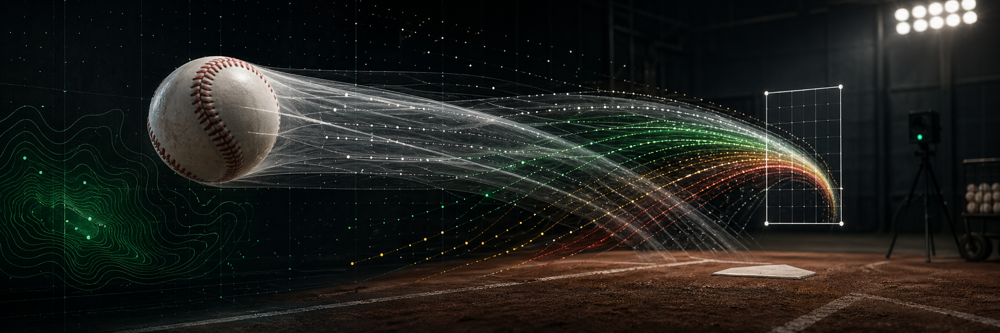
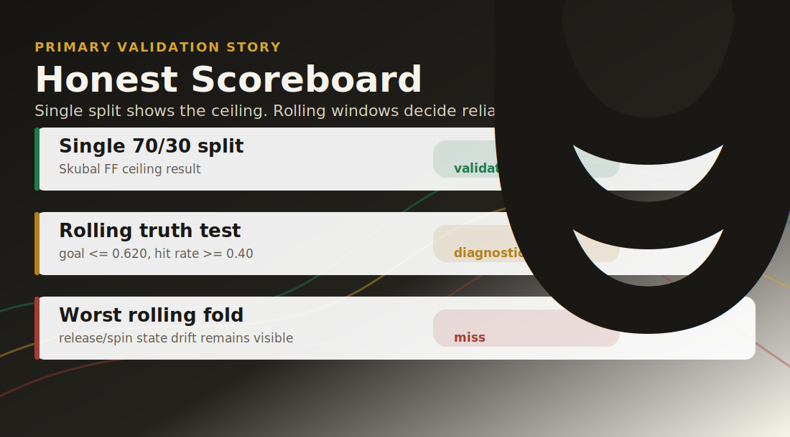
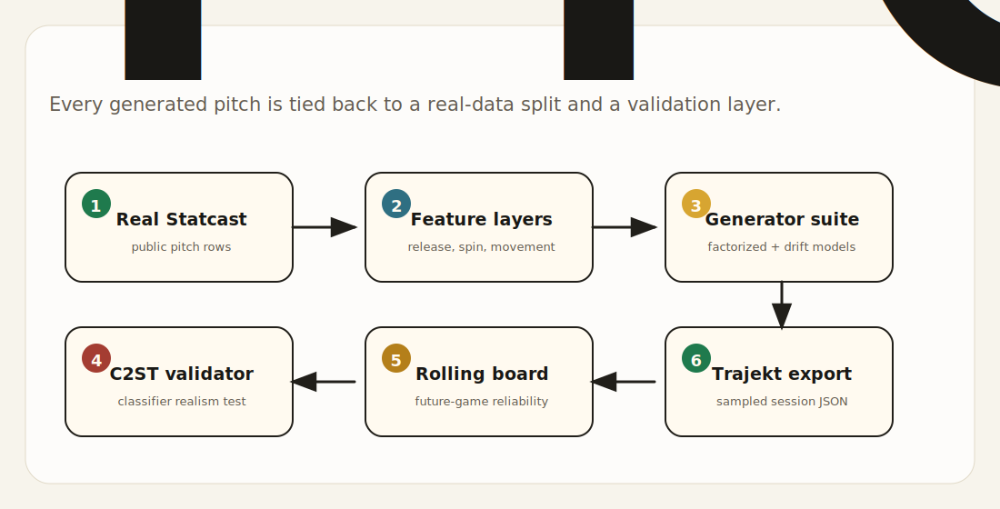
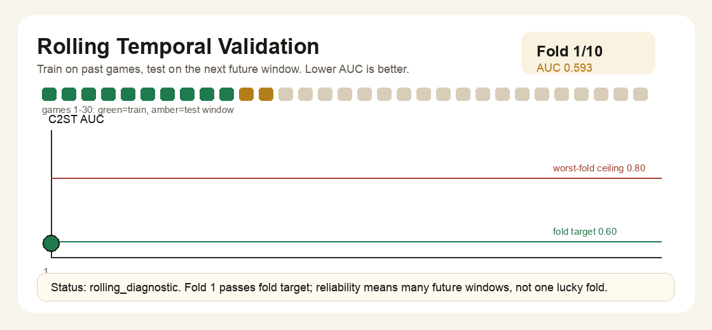

# Pitcher Twin



**A real pitcher doesn't throw one fastball — they throw a cloud of them, shaped by count, inning, batter, fatigue, score, and the simple fact that no human releases the ball the same way twice.** Pitcher Twin learns that cloud from public Statcast and generates pitches a classifier struggles to tell apart from real held-out ones.

> **🔗 Live demo:** **[pitcher-twin.vercel.app](https://pitcher-twin.vercel.app)** &nbsp;·&nbsp; **Interactive Streamlit:** `streamlit run app/streamlit_app.py`

---

## The honest scoreboard

| | Status | Result | Detail |
|---|---|---:|---|
| **Single 70/30 split** (Skubal 2025 FF) | ✅ validated | **0.533 AUC** · 100% pass | classifier trained to spot fakes barely beats a coin flip |
| **Rolling temporal stress test** (10 future-game folds) | 🟡 diagnostic | **0.702 mean AUC** | goal ≤ 0.620 · best fold 0.593 · worst fold 0.929 |
| **Cross-pitcher generalization** | 🟡 mixed | 4 pitchers · 3 pitch types | Skubal FF validates; SI/CH/Mattson/Peralta/Bradley remain diagnostic |

Lower AUC is better. `0.50` means a classifier specifically trained to detect synthetic pitches has no meaningful signal. Rolling validation is now the primary truth test — single-split AUC is treated as a ceiling, not a guarantee.



---

## What it does

Pitcher Twin models the **distribution** of a pitcher's actual pitch outcomes rather than a single centroid. It learns release, velocity, spin, movement, trajectory, and command from real Statcast rows, then generates pitch clouds that can be tested against future real pitches.

The goal is a practical generator that answers: *"If I want to practice this pitch type from this pitcher in this game state, what range of pitches should I expect?"*

The output is a Trajekt-shaped session JSON of sampled pitches with **layered validation metadata** — every pitch carries the trust level of every layer (command, movement, trajectory, release, full physics) so consumers can downgrade gracefully when full physics is still diagnostic.

---

## How it works



### The factorized physics chain (V2.1+)

Instead of modeling all pitch features as one tangled blob, the generator chains them in physical order:

```text
release point / velocity / spin
   → movement residual
   → trajectory residual
   → command residual
```

A Gaussian mixture at each layer captures the natural sub-modes (high-inside vs. low-away vs. middle-up fastballs aren't one distribution). Residual layers absorb the mechanical noise the pitcher didn't intend — the *human-error envelope*. Every layer is conditioned on game state (count, inning, batter handedness, pitch-count fatigue, score differential) and trend-anchored to capture mid-season drift in release point and stuff.

### The validator (classifier two-sample test)

For every model variant, we:

1. Train on the earlier 70% of a pitcher's pitches.
2. Generate synthetic samples from the trained model.
3. Mix synthetic samples with real held-out pitches from the later 30%.
4. Train a logistic-regression classifier to tell synthetic from real.
5. Report ROC-AUC. Lower means harder to detect.

The single-split version is the **ceiling**. The rolling temporal version repeats this across many future-game windows — which is now the primary truth test.

### The rolling temporal scoreboard

```text
train games  1-10  → test games 11-12
train games  1-12  → test games 13-14
...
train games  1-28  → test games 29-30
```

10 rolling folds, 4 repeats per fold. The "miss" flags are honest: the model can match some future windows (best fold 0.593) but still drifts hard on others (worst fold 0.929).



Editable architecture sketch: [`docs/assets/readme/pitcher-twin-architecture.excalidraw`](docs/assets/readme/pitcher-twin-architecture.excalidraw)

---

## Quick start

```bash
# install
pip install -r requirements.txt

# run the dashboard locally
streamlit run app/streamlit_app.py

# regenerate the headline tournament
python scripts/run_model_tournament.py \
  --data data/processed/skubal_2025.csv \
  --output-dir outputs/model_tournament_skubal_2025_ff \
  --pitcher-id 669373 \
  --pitch-type FF \
  --repeats 30

# regenerate the cross-pitcher validation board
python scripts/run_validation_board.py \
  --data data/processed/skubal_2025.csv \
  --output-dir outputs/validation_board_skubal_2025_top3 \
  --top 3 --repeats 3 --samples 260

# regenerate the rolling truth test
.venv/bin/python scripts/run_rolling_temporal_board.py \
  --data data/processed/skubal_2025.csv \
  --output-dir outputs/rolling_validation_skubal_2025_ff \
  --pitcher-id 669373 --pitch-type FF \
  --initial-train-games 10 --test-games 2 --step-games 2 --repeats 4
```

Run tests: `pytest -q`.

---

## What's in the repo

| Path | What lives there |
|---|---|
| `app/streamlit_app.py` | The hosted demo — hero overlay, try-it interactive, rolling truth test, validation board |
| `src/pitcher_twin/` | Core library — generators, factorized physics chain, validator, tournament, rolling validation |
| `scripts/` | CLI entry points: data fetch, tournaments, validation boards |
| `tests/` | pytest suite (93 tests) |
| `data/processed/skubal_2025.csv` | Public Statcast pull used by the live demo |
| `docs/presentation.md` | Client-facing single-page pitch |
| `docs/research-log.md` | Full V2.1 → V4 model chronology and ablations |
| `outputs/` | Generated tournament results, validation boards, scorecards |

---

## Data policy

- **Real data only.** No mock pitches, no synthetic weather, no fake players.
- Generated samples are **always labeled** as model output, never as observed.
- Holdout pitches are split temporally (last 30% of games), never randomly.

---

## What's next

The current frontier is concentrated in release-geometry and spin-axis modeling. The detection signal — the features the C2ST classifier exploits to spot fakes — is dominated by `release_pos_x`, `release_extension`, `spin_axis_cos/sin`, `release_spin_rate`, and `vy0`. Hand-tuned circular spin residuals (V4) didn't close the gap. The next concrete candidate:

```text
conditional release-state mixture
  with circular spin-axis component
  and velocity/spin covariance per latent state
```

i.e., learn the release/spin distribution as a conditional mixture given pitch family, recent game state, and count/fatigue — instead of fixing it to a global average.

---

## Links

- 📊 [`docs/presentation.md`](docs/presentation.md) — single-page client overview
- 📓 [`docs/research-log.md`](docs/research-log.md) — full V2.1 → V4 model chronology with ablations
- 🔬 [`docs/research/`](docs/research) — individual research notes per iteration
- 🛠 [`docs/implementation-plan.md`](docs/implementation-plan.md) — engineering plan
