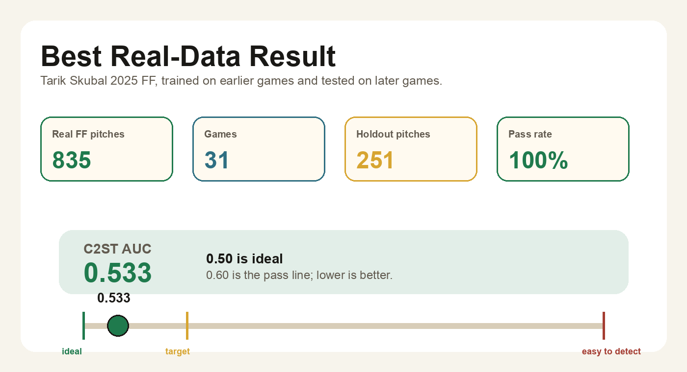
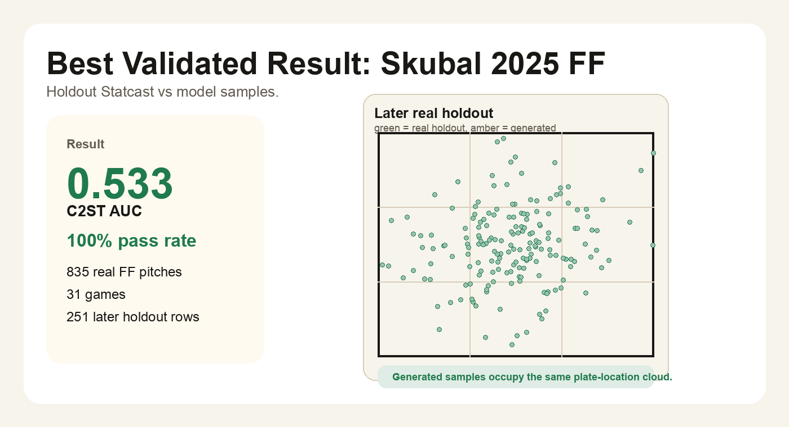
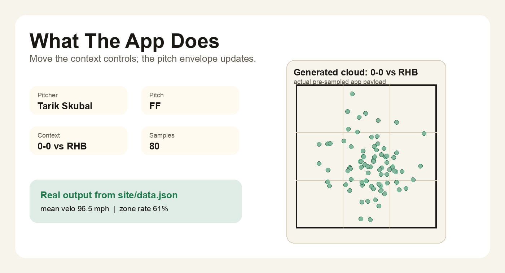
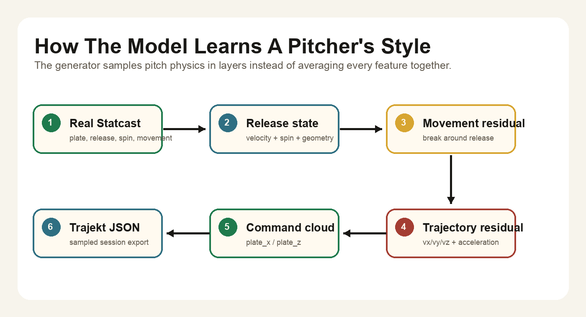
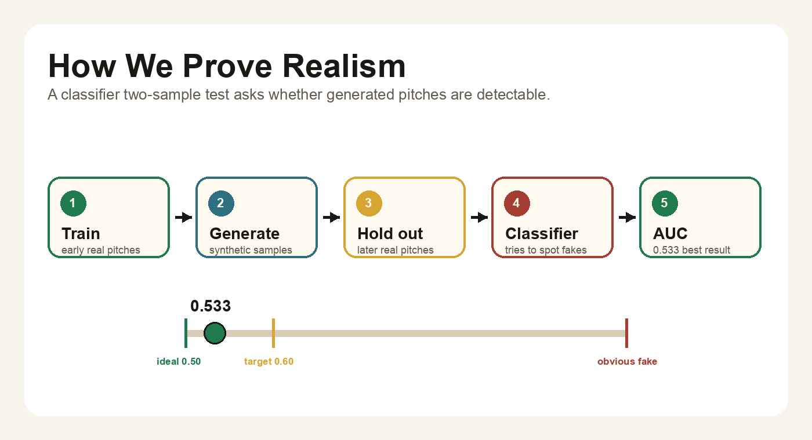
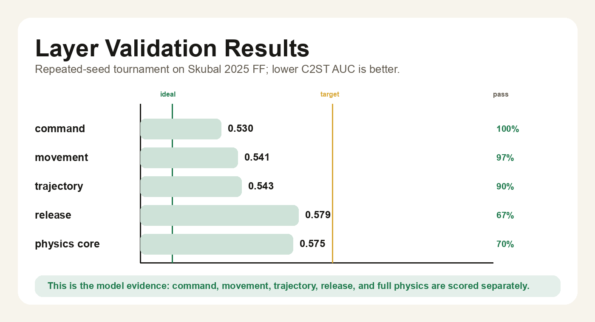
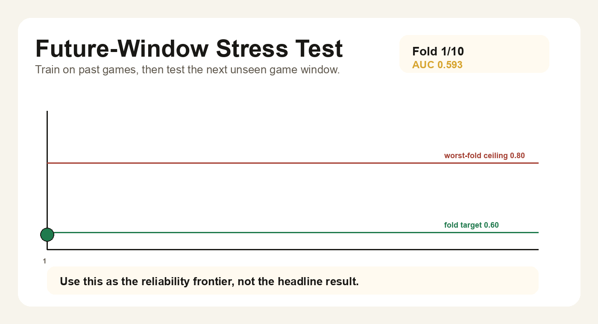

# Pitcher Twin

Pitcher Twin learns a pitcher's probability cloud from real Statcast data. Pick a pitcher, pitch type, and game context, then generate realistic pitch samples with validation metadata attached.

[Try the live app](https://pitcher-twin.vercel.app) | [Read the static report](https://pitcher-twin.vercel.app/report)

## Best Result

The strongest real-data result is **Tarik Skubal's 2025 four-seam fastball**. The model trains on earlier games, generates new pitch samples, and is tested against later held-out Statcast pitches.



| Metric | Result |
|---|---:|
| Real Skubal FF pitches | **835** |
| Games represented | **31** |
| Later holdout pitches | **251** |
| Classifier two-sample AUC | **0.533** |
| Repeated-seed pass rate | **100%** |

Lower AUC is better. `0.50` means a classifier cannot tell generated pitches from real held-out pitches. The pass line is `0.60`.



## What The App Shows

The app is a **conditional pitch probability explorer**. It does not predict one exact pitch. It shows the likely envelope of a pitch under a selected game situation.

The current UI lets you vary:

- pitcher and pitch type
- count bucket
- batter handedness
- game-state context used by the sampler
- number of generated samples

Each generated context comes from the real pre-sampled app payload in [`site/data.json`](site/data.json).



## How The Model Learns Style

The model learns style by separating a pitch into physical layers. Instead of treating every feature as one flat vector, it models the sequence that makes baseball sense:

```text
release state
  -> movement residual
  -> trajectory residual
  -> command cloud
  -> Trajekt-shaped export
```

That means it can learn more than "Skubal throws hard." It learns where his release tends to live, how his spin and velocity move together, how movement drifts from that release state, and where the ball tends to finish at the plate.



Editable architecture source: [model-architecture.excalidraw](docs/assets/readme/model-architecture.excalidraw)

## How Validation Works

The key test is a classifier two-sample test:

1. Train the generator on earlier real pitches.
2. Generate synthetic pitch samples.
3. Hold out later real pitches.
4. Train a classifier to separate real from generated.
5. Report ROC-AUC.

If the classifier struggles, the generated distribution looks realistic under that feature set.



The project scores each layer separately so the UI and export can say exactly what is validated.



## Reliability Stress Test

The best single split is the headline result. The rolling test is the harder future-window check: train on games 1-10, test games 11-12, then train on games 1-12, test games 13-14, and continue forward.



This stress test is useful because it shows where the model still needs work: some future windows are close to the target, while others expose game-to-game drift that the current sampler does not fully explain.

## Quick Start

```bash
pip install -r requirements.txt

python scripts/build_interactive_data.py
python scripts/build_static_site.py

python -m http.server 8000 --directory site
```

Then open `http://localhost:8000`.

Regenerate the main validation artifacts:

```bash
python scripts/run_model_tournament.py \
  --data data/processed/skubal_2025.csv \
  --output-dir outputs/model_tournament_skubal_2025_ff \
  --pitcher-id 669373 \
  --pitch-type FF \
  --repeats 30

python scripts/run_validation_board.py \
  --data data/processed/skubal_2025.csv \
  --output-dir outputs/validation_board_skubal_2025_top3 \
  --top 3 --repeats 3 --samples 260

.venv/bin/python scripts/run_rolling_temporal_board.py \
  --data data/processed/skubal_2025.csv \
  --output-dir outputs/rolling_validation_skubal_2025_ff \
  --pitcher-id 669373 \
  --pitch-type FF \
  --initial-train-games 10 \
  --test-games 2 \
  --step-games 2 \
  --repeats 4
```

Regenerate the README visuals from tracked outputs:

```bash
.venv/bin/python scripts/build_readme_visuals.py
```

Run tests:

```bash
PYTEST_DISABLE_PLUGIN_AUTOLOAD=1 pytest -q
```

## Repo Map

| Path | What lives there |
|---|---|
| [`site/`](site) | Hosted static app, report page, and pre-sampled app payload |
| [`src/pitcher_twin/`](src/pitcher_twin) | Core generator, validation, tournament, and conditional sampling code |
| [`scripts/build_interactive_data.py`](scripts/build_interactive_data.py) | Builds the app's pitcher and context sample grid |
| [`scripts/run_model_tournament.py`](scripts/run_model_tournament.py) | Trains and compares model variants |
| [`scripts/run_validation_board.py`](scripts/run_validation_board.py) | Builds the cross-pitch validation leaderboard |
| [`scripts/run_rolling_temporal_board.py`](scripts/run_rolling_temporal_board.py) | Runs the rolling future-window stress test |
| [`data/processed/skubal_2025.csv`](data/processed/skubal_2025.csv) | Real Statcast dataset used by the app and README |
| [`outputs/`](outputs) | Generated reports, leaderboards, and validation boards |
| [`docs/research-log.md`](docs/research-log.md) | Model chronology and ablations |
| [`docs/assets/readme/`](docs/assets/readme) | README visuals generated from real artifacts |

## Data Policy

- Real public Statcast rows only.
- Generated pitches are always labeled as generated.
- Holdout rows are split temporally, not randomly.
- Weather is not claimed in the headline model unless it improves validation.

## Current Frontier

The impressive part is already real: the model can generate Skubal FF samples that are difficult to distinguish from later real pitches on the validated split. The next meaningful frontier is rolling robustness: reducing the bad future windows by improving release geometry, spin-axis behavior, and game-to-game drift.
