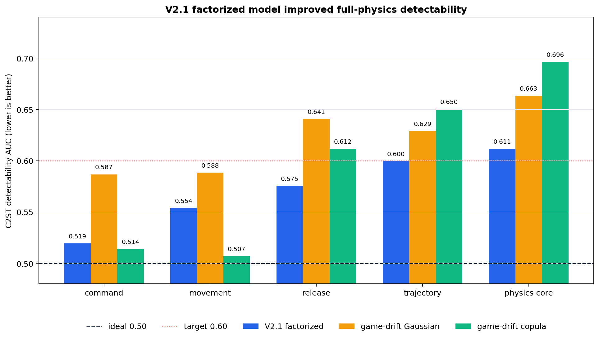
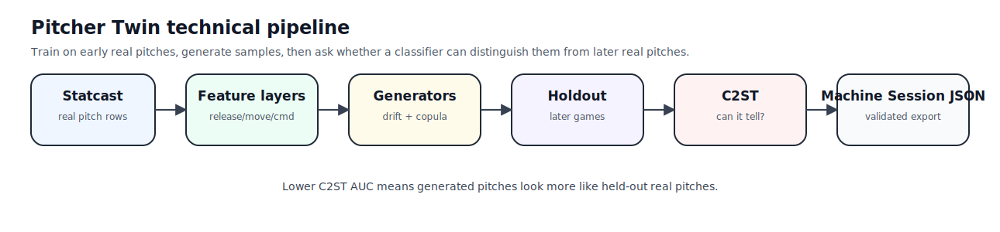
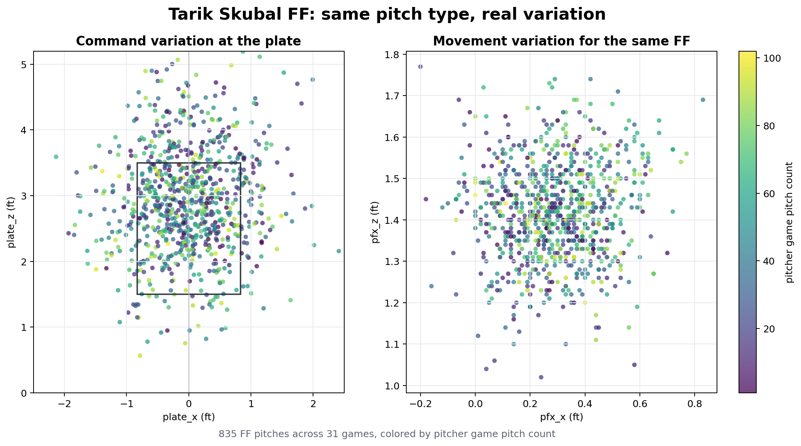
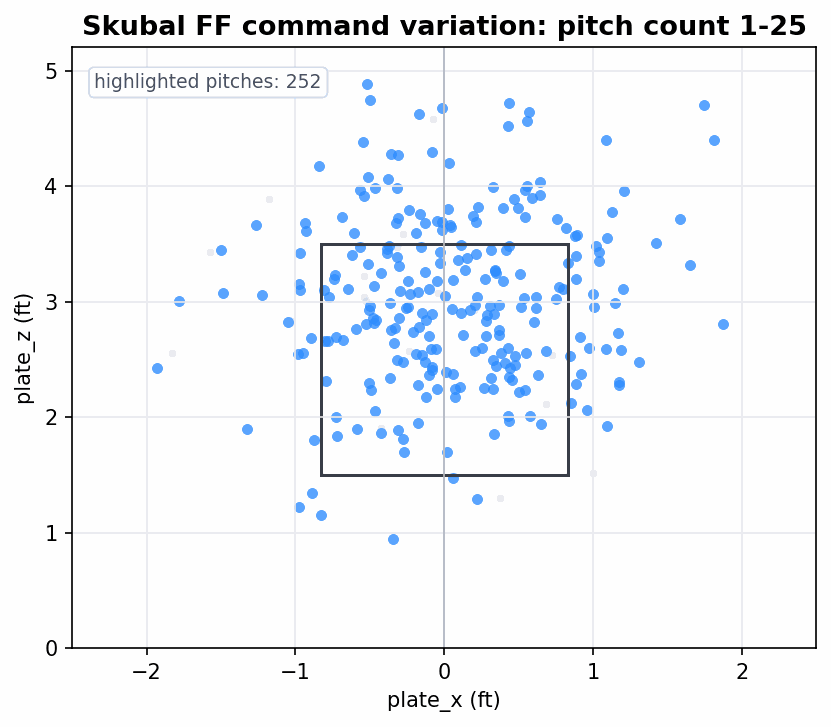
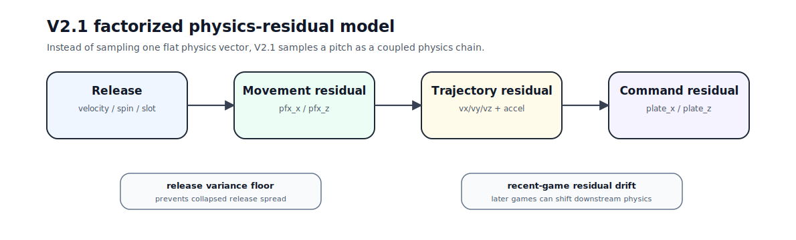

# Pitcher Twin

**Pitcher Twin learns a real pitcher’s pitch-to-pitch variability from public Statcast and generates validated pitch distributions, not one average pitch.** It measures whether generated pitches look like later real pitches using **C2ST AUC**, where **0.50 is ideal** and **<= 0.60 is the validation target**.

## Results

The strongest current model is **V2.1 factorized physics residual**. On Tarik Skubal 2025 four-seam fastballs, it improves the hardest full-physics layer from the game-drift baselines to **0.611 C2ST AUC**, just above the `<= 0.60` validation target.



| Layer | V2.1 factorized | Game-drift Gaussian | Game-drift copula | Status |
|---|---:|---:|---:|---|
| command/location | 0.519 | 0.587 | 0.514 | strong |
| movement only | 0.554 | 0.588 | 0.507 | strong |
| release only | 0.575 | 0.641 | 0.612 | improved |
| trajectory only | 0.600 | 0.629 | 0.650 | borderline |
| physics core | 0.611 | 0.663 | 0.696 | improved, still diagnostic |

What this means:

- **Command and movement are strong.**
- **Full joint physics improved meaningfully, but is still diagnostic.**
- The next model gap is preserving coupled release, spin-axis, release-extension, trajectory, and command structure.

## What We Built

- Real Statcast ingestion and feature cleaning.
- Candidate ranking for viable `(pitcher, pitch_type)` pairs.
- Temporal train/holdout validation: earlier pitches train, later pitches test.
- A generator suite: empirical, Gaussian, recent-window, context-weighted, game-drift, copula, GMM, and V2.1 factorized residual models.
- C2ST validation that asks whether a classifier can distinguish generated pitches from held-out real pitches.
- Machine-session JSON export with validation metadata.
- README visuals: real pitch-variation graphs, an animated GIF, result chart, SVG diagrams, and editable Excalidraw sources.

## How It Works

The core loop is:



Editable Excalidraw source: [pitcher_twin_pipeline.excalidraw](docs/assets/readme/pitcher_twin_pipeline.excalidraw)

Validation uses a classifier two-sample test:

1. Train models on earlier real pitches.
2. Generate pitch samples.
3. Mix generated pitches with later real holdout pitches.
4. Train a classifier to tell generated from real.
5. Score detectability AUC.

Lower AUC is better. `0.50` means the generated and real holdout pitches are hard to distinguish.

## Case Study

The current case study is **Tarik Skubal 2025 FF**:

- `2,849` total Statcast rows
- `835` Skubal FF pitches
- `31` games
- `584` train pitches
- `251` temporal holdout pitches

This is the same pitch type from the same pitcher. The spread is real Statcast variation, not generated data.



The animation slices those same FF pitch locations by pitcher game pitch count.



## Technical Idea

Pitcher Twin models a pitch as coupled layers, not one flat vector:

| Layer | What it captures | Example columns |
|---|---|---|
| release | how the ball leaves the hand | `release_speed`, `release_spin_rate`, `spin_axis`, release slot |
| movement | ball movement summary | `pfx_x`, `pfx_z` |
| trajectory | fitted flight dynamics | `vx0`, `vy0`, `vz0`, `ax`, `ay`, `az` |
| command | where the pitch finishes | `plate_x`, `plate_z` |
| physics core | all layers together | release + movement + trajectory + command |

V2.1 samples the pitch as a physics chain:



Editable Excalidraw source: [v21_physics_chain.excalidraw](docs/assets/readme/v21_physics_chain.excalidraw)

V2.1 uses:

- the strongest release generator from the existing model suite;
- residual layers for movement, trajectory, and command;
- Gaussian-copula downstream residual sampling;
- recent-game downstream residual drift;
- a train-only release variance floor.

## Reproduce

Install dependencies:

```bash
python3 -m venv .venv
source .venv/bin/activate
python3 -m pip install -r requirements.txt
```

Run tests:

```bash
pytest -q
```

Fetch the Skubal 2025 data:

```bash
python3 scripts/fetch_baseball_savant_pitcher_csv.py \
  --pitcher-id 669373 \
  --season 2025 \
  --output data/processed/skubal_2025.csv
```

Run the V2.1 validation:

```bash
python3 scripts/run_factorized_validation.py \
  --data data/processed/skubal_2025.csv \
  --output-dir outputs/factorized_skubal_2025_ff \
  --pitcher-id 669373 \
  --pitch-type FF
```

Regenerate README visuals:

```bash
python3 scripts/build_readme_visuals.py \
  --data data/processed/skubal_2025.csv \
  --output-dir docs/assets/readme
```

## Key Files

| Path | Purpose |
|---|---|
| [src/pitcher_twin/models.py](src/pitcher_twin/models.py) | generator suite, game drift, copula helpers |
| [src/pitcher_twin/factorized.py](src/pitcher_twin/factorized.py) | V2.1 factorized physics-residual model |
| [src/pitcher_twin/features.py](src/pitcher_twin/features.py) | real Statcast feature engineering |
| [src/pitcher_twin/validator.py](src/pitcher_twin/validator.py) | temporal split and C2ST validation |
| [scripts/run_factorized_validation.py](scripts/run_factorized_validation.py) | V2.1 validation runner |
| [scripts/build_readme_visuals.py](scripts/build_readme_visuals.py) | README graph, GIF, SVG, and Excalidraw generation |

## Data Policy

This project is real-data only.

- No mock pitch rows.
- No synthetic weather rows.
- No fake player examples.
- No silent fallback demo data.
- Generated samples are allowed only when labeled as model output.

## Next Work

- Run repeated-seed robustness for V2.1.
- Preserve spin-axis and release-extension structure more tightly.
- Add count/fatigue effects inside residual-drift layers.
- Test V2.1 across more pitcher/pitch pairs.
- Revisit weather only after the physics-residual layer clears the validation target.
