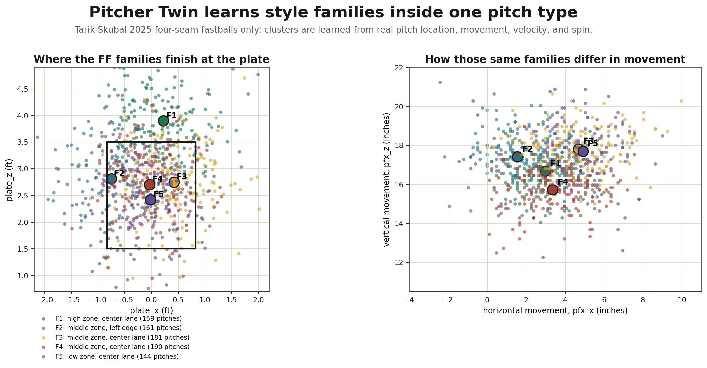
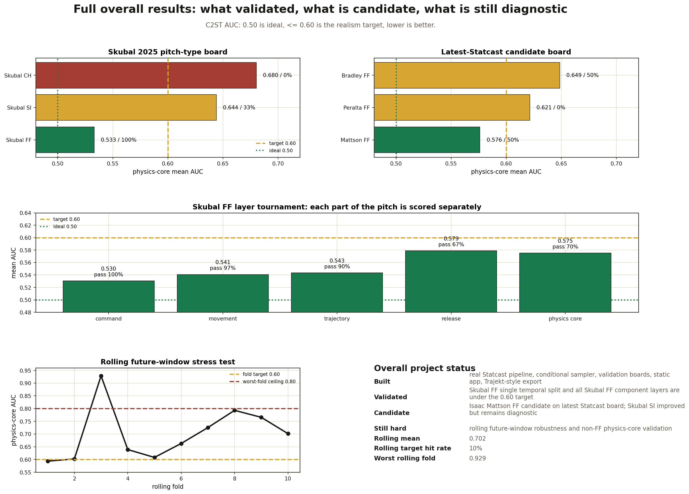
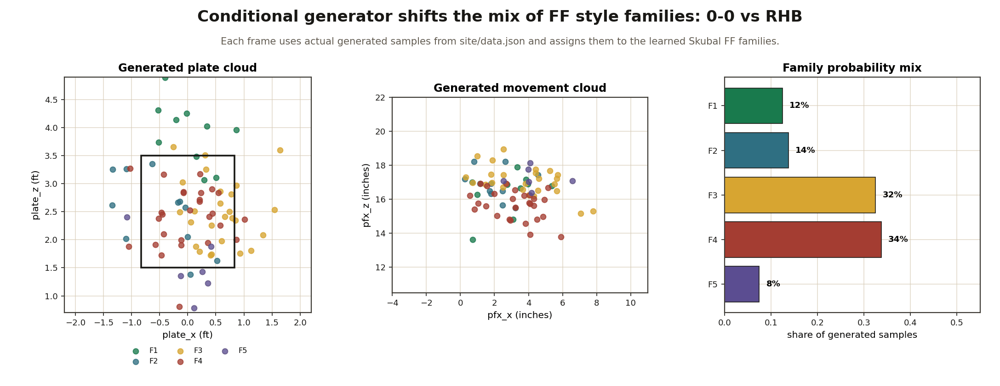
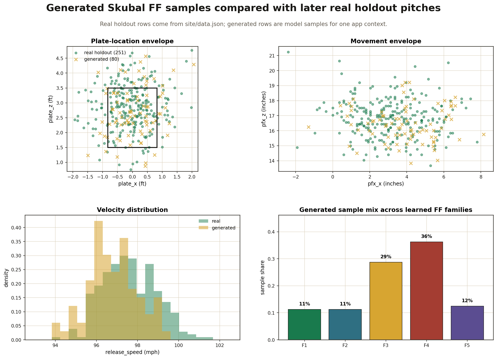

# Pitcher Twin

Pitcher Twin learns **style families inside one pitch type** from real Statcast data, then generates realistic pitch envelopes for chosen game contexts.

The product idea is not "Skubal throws a fastball." It is:

> Skubal's fastball has repeatable sub-styles. Some finish higher, some live lower, some move differently, and some appear more often in certain game contexts. Pitcher Twin learns those families and samples from them.

[Try the live app](https://pitcher-twin.vercel.app) | [Read the static report](https://pitcher-twin.vercel.app/report)

## 1. Pitch Families Inside One Pitch Type

This is the core model target.

For a single pitcher and a single pitch type, the model looks for recurring **style families**. In the example below, every point is a real Tarik Skubal 2025 four-seam fastball. The colors are learned families inside that one pitch type.



This is what the generator is trying to reproduce: not one average fastball, but a mixture of fastball families with different location, movement, velocity, and spin patterns.

## 2. Full Overall Results

This is the current project status across the artifacts we built: pitch-type boards, candidate boards, layer-level validation, and rolling future-window validation.



### Result Summary

| Area | What happened |
|---|---|
| Skubal FF | Validated on the main temporal board: physics-core AUC `0.533`, pass rate `100%`. |
| Skubal SI | Improved candidate direction, but still diagnostic: physics-core AUC `0.644`, pass rate `33%`. |
| Skubal CH | Still diagnostic: physics-core AUC `0.680`, pass rate `0%`. |
| Latest Statcast candidates | Isaac Mattson FF is a candidate: AUC `0.576`, pass rate `50%`; Peralta FF and Bradley FF remain diagnostic. |
| Skubal FF layers | Command, movement, trajectory, release, and physics core are all under the `0.60` target in the repeated-seed tournament. |
| Rolling validation | Still the hard frontier: mean rolling AUC `0.702`, target hit rate `10%`, worst fold `0.929`. |

The honest takeaway:

> The system can learn and regenerate a strong single-pitch-type family distribution, especially for Skubal FF. The harder remaining problem is making that realism stable across every future game window and across more pitch types.

## 3. What We Built

The repo now contains a full real-data pipeline:

1. **Statcast data layer**: loads real pitch rows from public Statcast exports.
2. **Feature layer**: extracts plate location, movement, velocity, spin, release, trajectory, count, handedness, and game context features.
3. **Pitch-family model**: learns recurring families inside one pitch type.
4. **Conditional sampler**: generates pitch samples for chosen game contexts.
5. **Validation system**: compares generated samples against later real pitches using classifier two-sample tests.
6. **Tournament runner**: compares model variants and records layer-level results.
7. **Rolling validator**: tests future game windows instead of one static split.
8. **Static app and report**: exposes the generator and pre-sampled outputs in `site/`.
9. **Trajekt-style export path**: prepares generated pitch sessions as structured JSON.

## 4. How Pitch Families Are Learned

For one pitcher and one pitch type, the model builds a feature vector for every real pitch:

```text
plate location
+ movement
+ velocity
+ spin
+ release information
+ game context
```

Then it learns recurring sub-families inside that pitch type. For Skubal FF, the families are not hand-labeled. They are learned from real pitch geometry and physics. A family can represent a high-zone fastball shape, a lower-zone shape, a left-edge/right-edge command shape, or a movement-heavy cluster.

The point is that the generated pitch is sampled from a **mixture of style families**, not from one average fastball.

## 5. How Conditional Generation Works

Given:

```text
pitcher = Tarik Skubal
pitch type = FF
context = count / batter hand / game state
```

the generator returns a probability distribution over realistic pitch characteristics:

- plate location
- movement
- velocity
- spin
- family membership
- generated samples for the app/export layer

The GIF below uses generated samples from [`site/data.json`](site/data.json). Each frame assigns generated pitches back to the learned Skubal FF families and shows how the family mix changes by context.



## 6. Real vs Generated Diagnostics

The validation question is:

> Do generated pitches look like later real pitches?

This plot compares later real Skubal FF holdout rows with generated samples from the app payload.



## 7. How Validation Works

The main validation method is a **classifier two-sample test**:

1. Train the generator on earlier real pitches.
2. Generate synthetic pitch samples.
3. Hold out later real pitches.
4. Train a classifier to separate real from generated.
5. Report ROC-AUC.

Interpretation:

- `0.50`: ideal; classifier cannot tell real from generated.
- `<= 0.60`: target pass range.
- `> 0.60`: generated samples are detectably different.

The project reports results by pitch type, by physics layer, and by rolling future-game windows so the README does not hide where the model still struggles.

## 8. Demo And How To Run

Preview the static app:

```bash
pip install -r requirements.txt

python scripts/build_interactive_data.py
python scripts/build_static_site.py

python -m http.server 8000 --directory site
```

Then open `http://localhost:8000`.

Regenerate the README visuals:

```bash
.venv/bin/python scripts/build_readme_visuals.py
```

Regenerate the main validation artifacts:

```bash
python scripts/run_model_tournament.py \
  --data data/processed/skubal_2025.csv \
  --output-dir outputs/model_tournament_skubal_2025_ff \
  --pitcher-id 669373 \
  --pitch-type FF \
  --repeats 30

python scripts/run_validation_board.py \
  --data data/processed/skubal_2025.csv \
  --output-dir outputs/validation_board_skubal_2025_top3_v4 \
  --top 3 --repeats 3 --samples 260

.venv/bin/python scripts/run_rolling_temporal_board.py \
  --data data/processed/skubal_2025.csv \
  --output-dir outputs/rolling_validation_skubal_2025_ff \
  --pitcher-id 669373 \
  --pitch-type FF \
  --initial-train-games 10 \
  --test-games 2 \
  --step-games 2 \
  --repeats 4
```

Run tests:

```bash
PYTEST_DISABLE_PLUGIN_AUTOLOAD=1 pytest -q
```

## Repo Map

| Path | What lives there |
|---|---|
| [`site/`](site) | Hosted static app, report page, and pre-sampled app payload |
| [`src/pitcher_twin/`](src/pitcher_twin) | Core generator, validation, tournament, rolling validation, and conditional sampling code |
| [`scripts/build_readme_visuals.py`](scripts/build_readme_visuals.py) | Reproducible Matplotlib README visual builder |
| [`scripts/build_interactive_data.py`](scripts/build_interactive_data.py) | Builds the app's pitcher/context sample grid |
| [`scripts/run_model_tournament.py`](scripts/run_model_tournament.py) | Trains and compares model variants |
| [`scripts/run_validation_board.py`](scripts/run_validation_board.py) | Builds pitch-type validation leaderboards |
| [`scripts/run_rolling_temporal_board.py`](scripts/run_rolling_temporal_board.py) | Runs rolling future-window validation |
| [`data/processed/skubal_2025.csv`](data/processed/skubal_2025.csv) | Real Statcast dataset used by the app and README |
| [`outputs/`](outputs) | Generated reports, leaderboards, tournaments, and rolling validation boards |
| [`docs/research-log.md`](docs/research-log.md) | Model chronology and ablations |
| [`docs/assets/readme/`](docs/assets/readme) | README visuals generated from real artifacts |

## Data Policy

- Real public Statcast rows only.
- Generated pitches are always labeled as generated.
- Holdout rows are split temporally, not randomly.
- Weather is not part of the headline claim unless it improves validation.

## Current Frontier

The next meaningful work is not making the README louder. It is improving rolling robustness and generalizing the family model across more pitch types and pitchers without losing the strong Skubal FF result.
